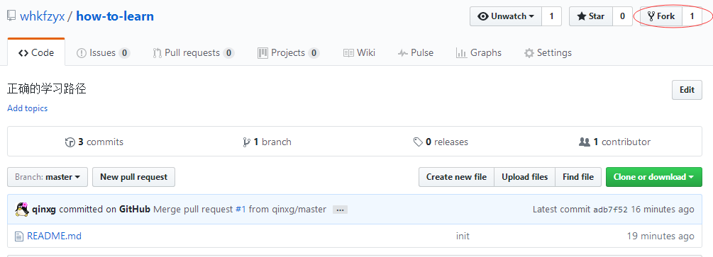
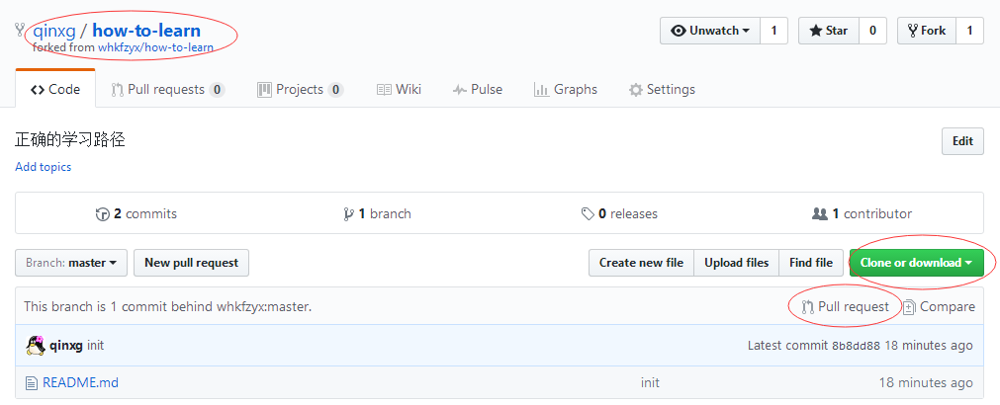

# how-to-learn
> 모바일 웹앱 개발 학습 곡선

## 开发资料

### 入门

* **[html]** - Html은 웹 페이지를 작성하기위한 표준 마크 업 언어로서,이 튜토리얼에서는 html을 사용하여 웹 페이지를 작성하는 방법을 학습합니다。

* **[html5]** - Html5는 html의 새로운 세대입니다.이 튜토리얼에서는 html5의 새로운 기능에 대해 설명합니다。

* **[css]** - CSS는 웹 페이지의 스타일과 레이아웃을 제어하는 데 사용됩니다.이 튜토리얼에서는 CSS를 사용하여 여러 웹 페이지의 스타일과 레이아웃을 제어하는 방법을 배우게됩니다。

* **[css3]** - Css3는 최신 CSS 표준입니다.이 자습서에서는 css3의 새로운 기능을 소개합니다。

* **[javascript]** - JavaScript는 웹에 속한 스크립팅 언어로서,이 튜토리얼에서는 자바 스크립트의 표준 구문과 응용 프로그램에 대해 자세히 설명합니다。

* **[vue프레임 워크]** - Vue는 뷰 레이어에 중점을두고 있으며 데이터 기반 웹 인터페이스를 구축하기위한 라이브러리입니다.이 튜토리얼은 공식 문서에서 제공되며 vue를 배우기 위해 단계별로 안내합니다。

### 실전

* **[router]** - e.js를 사용한 라우팅 플러그인의 공식적인 유지 관리。

* **[axios]** - Axios는 브라우저에서 사용할 수 있고 node.js에서 사용할 수있는 약속 기반 HTTP 라이브러리입니다. XMLHttpRequests와 노드 사이의 XML 인터페이스를 처리하는 API를 제공합니다。

* **[vuex]** - 플러그 - 인 컨트롤 vue 데이터 흐름 세트의 공식적인 유지 관리。

* **[调试]** - 크롬 개발 도구는 웹 개발자가 브라우저 응용 프로그램을 통해 웹 페이지를 개입하고 조작 할 수있게 해주는 도구이며,이 도구를 통해 웹 페이지 또는 웹 응용 프로그램을 디버깅하고 테스트 할 수도 있습니다。

* **[vux]** - vue 프레임 워크 및 WeChat WeUI 스타일 라이브러리를 기반으로하는 타사 vue 구성 요소 라이브러리 집합은 대부분의 기본 응용 프로그램 시나리오를 만족시킬 수 있습니다。

#### 고급

* **[es6]** - ECMAScript 6.0 (약식 es6)은 2015 년 6 월 공식적으로 발표 된 자바 스크립트 언어의 차세대 표준입니다。

## 내부 강좌

### 시작하기

* **[vue기본]** - 소개 vue 기본 문법, 숙제를 통해, 당신은 기본 연습을 완료합니다。

* **[vue구성 요소 시작하기]** - 구성 요소간에 vue 구성 요소 및 데이터 전송을 만드는 기본 방법을 소개합니다. 수업이 끝나면 구성 요소 응용 프로그램에 대한 기본적인 이해와 이해를 할 수 있습니다.。

### 기본 응용 프로그램

* **[vue구성 요소 응용 프로그램 실행（上）]** 、 **[vue구성 요소 응용 프로그램 연습（下）]** - 실제 프로젝트 응용 프로그램에서 프로젝트 구축 방법을 소개하고 모듈 식 개발에서 단일 파일 구성 요소 형식을 vue로 지정하고 **[전형적인UI]** 설명 할 페이지의 코드 분석 **[VUX]** 이 과제를 통해 구성 요소 라이브러리를 적용하면 기본적으로 실제 프로젝트의 전체 프로세스를 파악하고 단일 파일 구성 요소의 사용법을 이해할 수 있습니다。

* **[vue모바일통신 vue-router]** 、 **[vue모바일통신 axios]** 、 **[vue모바일통신vuex]** - vue family bucket의 다른 멤버들에 대해서 설명하기 만하면됩니다 .3 코스의 내용을 마스터 한 후에는 완벽한 모바일 터미널 vue 프로젝트를 독립적으로 완성 할 수 있습니다. 과정 학습 과정에서 기본적인 타사 구성 요소 사용 모드를 이해할 수 있습니다. 나중에 독립적 인 개발 과정에서 또한 프로젝트 구성 요소를 확장 할 수 있습니다。

## 역량 평가

>역량 평가는 정보 수준에 대해 학습함으로써 앱을 개발하기 전에 숙지해야하는 기술을 평가하는 데 도움이되는 작은 도구입니다. 나는 그것이 곧 편리 할 것이라고 믿는다~

### 간단한 APP 개발
* 마스터 html (5), 자바 스크립트 기본 구문 :
     * 마스터 HTML 태그 사용 및 블록 상자와 인라인 상자를 구분할 수 있습니다
     * 마스터 자바 스크립트 기본 구문
* 마스터 CSS :
     * 기본 문법
     * 셀렉터
     * CSS 위치
     * [박스 모델]
* 기본 개발 프로세스 마스터 :
     * Nodejs, npm 환경 빌드 및 실행
     * [Mingyuan Project Scaffolding] 용도
* 마스터 [vue 프레임 워크] 모든 지식 포인트
* [연습] 간단한 HTML 페이지 개발

### 공통 앱 개발하기
* 마스터와 설명 [es6] 기능 :
     * 변수 선언 let, const
     * 화살표 기능
     * 약속의 물건
     * 가져 오기, 내보내기
     * 해체 지정
* 사전 배경 요청을하고 도메인 간 구성에 익숙해집니다.
* 로컬 API 호출에 익숙해야합니다.
간단한 디버깅 및 오류 위치 지정
* 일반 구성 요소 개발을 독립적으로 완료
* [연습] 복잡한 페이지 레이아웃 ([flex] 레이아웃 파악)

### 높은 성능과 높은 상호 작용을 가진 APP 개발

* 커뮤니티 기반의 컴포넌트 확장
* 타사 오픈 소스 라이브러리 평가 및 도입
* 사례 분석 및 전형적인 함수 강수량

## 기타 보조제

시간이 없다.

## 기부에 참여하는 방법?

### 문제가 있습니다.

** [issues] **에 질문을 등록 할 수 있으며 처음으로 처리 할 것입니다。

### 나는 경험이있다.
우리는 공유가 학습을 감지하는 더 좋은 방법이라고 생각합니다.

학습 과정 중에 다음 프로세스에 따라 다음 정보를 제출할 수 있습니다.

*이 문서를 실행하려면 오른쪽 상단의을 클릭하십시오.
* 로컬에 복제하고 자체 저장소에서 수정
* 올바른 내용이 올바른지 확인하고 서버에 동기화하십시오.
* 당겨 요청을 클릭하여 ** whkfzyx ** trunk에 변경 사항을 제출하십시오.
* ** whkfzyx ** 변경 사항을 검토하고 받아들입니다.

(fork문서)

（문서 수정 및 제출）

### 참여자보기

누가 가장 기여합니까? Poke -> [프로젝트 기여도]

<!-- References -->

[html]: http://www.w3school.com.cn/html/index.asp
[html5]: http://www.w3school.com.cn/html5/index.asp
[css]: http://www.w3school.com.cn/css/index.asp
[css3]: http://www.w3school.com.cn/css3/index.asp
[javascript]: http://www.w3school.com.cn/b.asp
[vue프레임 워크]: https://cn.vuejs.org/v2/guide/

[박스 모델]: http://www.w3school.com.cn/css/css_boxmodel.asp

[router]: https://router.vuejs.org/zh-cn/
[axios]: https://github.com/mzabriskie/axios
[vuex]: https://vuex.vuejs.org/zh-cn/getting-started.html
[디버깅]: http://www.w3cplus.com/tools/how-to-use-chrome-devtools-like-a-pro.html
[vux]: https://vux.li/#/zh-CN/README

[flex]: http://www.ruanyifeng.com/blog/2015/07/flex-grammar.html

[es6]: http://es6.ruanyifeng.com/

[vue기본]: https://github.com/whkfzyx/how-to-learn/tree/master/lesson/1.vue基础入门
[vue구성 요소 시작하기]: https://github.com/whkfzyx/how-to-learn/tree/master/lesson/2.vue组件入门
[vue구성 요소 응용 프로그램 연습（上）]: ./lesson/3.vue组件应用之基础篇
[vue구성 요소 응용 프로그램 연습（下）]: ./lesson/4.vue组件应用之实操篇
[vue모바일통신 vue-router]: ./lesson/5.vue移动交付之vue-router
[vue모바일통신 axios]: ./lesson/6.vue移动交付之axios
[vue모바일통신 vuex]: ./lesson/7.vue移动交付之vuex
[典型UI]: https://github.com/whkfzyx/vue2.x-mysoft-standardui

[프로젝트 기여]:https://github.com/whkfzyx/how-to-learn/graphs/contributors

[issues]:https://github.com/whkfzyx/how-to-learn/issues

[Mingyuan 프로젝트 비계]:https://github.com/whkfzyx/cli
